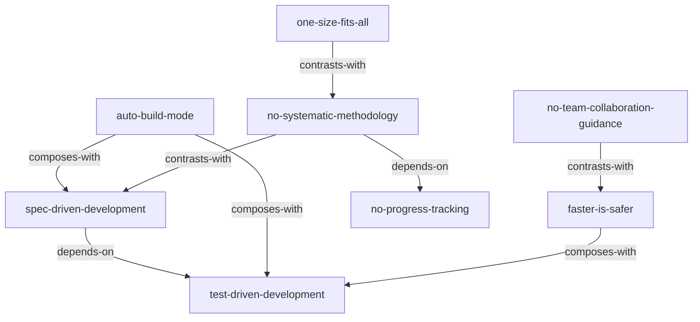

# INDEX.md - addyosmani/agent-skills Skills 知识网络

> 基于 Zettelkasten 方法建立的技能引用关系图

## 📊 Skills 概览

| Skill | 类型 | 描述 |
|-------|------|------|
| [spec-driven-development](./spec-driven-development/SKILL.md) | Framework | 规格说明驱动开发（Spec before code） |
| [test-driven-development](./test-driven-development/SKILL.md) | Framework | 测试驱动开发（Tests are proof） |
| [auto-build-mode](./auto-build-mode/SKILL.md) | Framework | 自动构建模式（平衡自动化与安全性） |
| [faster-is-safer](./faster-is-safer/SKILL.md) | Principle | 更快更安全（频繁部署降低风险） |
| [no-systematic-methodology](./no-systematic-methodology/SKILL.md) | Anti-Pattern | 缺乏系统性方法论 |
| [no-progress-tracking](./no-progress-tracking/SKILL.md) | Anti-Pattern | 缺少进度追踪 |
| [no-team-collaboration-guidance](./no-team-collaboration-guidance/SKILL.md) | Anti-Pattern | 缺少团队协作指导 |
| [one-size-fits-all](./one-size-fits-all/SKILL.md) | Anti-Pattern | 一刀切（缺乏灵活性） |

## 🔗 引用关系图



## 📋 按类型分类

### Frameworks（3 个）
1. **spec-driven-development**: 规格说明驱动开发
2. **test-driven-development**: 测试驱动开发
3. **auto-build-mode**: 自动构建模式

### Principles（1 个）
4. **faster-is-safer**: 更快更安全

### Anti-Patterns（4 个）
5. **no-systematic-methodology**: 缺乏系统性方法论
6. **no-progress-tracking**: 缺少进度追踪
7. **no-team-collaboration-guidance**: 缺少团队协作指导
8. **one-size-fits-all**: 一刀切

## 🎯 使用指南

### 新手入门路径
1. 从 `spec-driven-development` 开始，学习如何明确需求
2. 进入 `test-driven-development`，学习如何验证代码正确性
3. 掌握 `auto-build-mode`，学习如何平衡自动化与安全性
4. 了解 `faster-is-safer`，学习如何快速安全地部署

### 反模式识别路径
1. 阅读 `no-systematic-methodology`，识别缺乏系统性方法论的问题
2. 阅读 `no-progress-tracking`，识别缺少进度追踪的问题
3. 阅读 `no-team-collaboration-guidance`，识别缺少团队协作指导的问题
4. 阅读 `one-size-fits-all`，识别一刀切的问题

### 完整开发生命周期
```
DEFINE (spec-driven-development) → 
PLAN → 
BUILD (auto-build-mode) → 
VERIFY (test-driven-development) → 
REVIEW → 
SHIP (faster-is-safer)
```

*最后更新: 2026-08-24*
