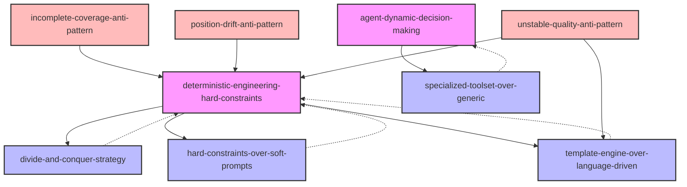

# INDEX.md - Open Code Review Skills 知识网络

> 基于 alibaba/open-code-review 蒸馏的 9 个原子化 skills，通过 Zettelkasten 链接形成知识网络。

## 📊 Skills 概览

| Skill | 类型 | 核心职责 |
|-------|------|----------|
| [deterministic-engineering-hard-constraints](./deterministic-engineering-hard-constraints/SKILL.md) | Framework | 确定性工程硬约束 |
| [agent-dynamic-decision-making](./agent-dynamic-decision-making/SKILL.md) | Framework | Agent 动态决策优势 |
| [divide-and-conquer-strategy](./divide-and-conquer-strategy/SKILL.md) | Framework | 分治策略 |
| [hard-constraints-over-soft-prompts](./hard-constraints-over-soft-prompts/SKILL.md) | Principle | 硬约束优于软提示 |
| [template-engine-over-language-driven](./template-engine-over-language-driven/SKILL.md) | Principle | 模板引擎优于语言驱动规则 |
| [specialized-toolset-over-generic](./specialized-toolset-over-generic/SKILL.md) | Principle | 专用工具集优于通用工具集 |
| [incomplete-coverage-anti-pattern](./incomplete-coverage-anti-pattern/SKILL.md) | Anti-Pattern | 不完整覆盖反模式 |
| [position-drift-anti-pattern](./position-drift-anti-pattern/SKILL.md) | Anti-Pattern | 位置漂移反模式 |
| [unstable-quality-anti-pattern](./unstable-quality-anti-pattern/SKILL.md) | Anti-Pattern | 质量不稳定反模式 |

## 🔗 引用关系图

**图例**：
- 🟪 **Frameworks** (F1-F3): 粉色背景，核心架构模块
- 🟦 **Principles** (P1-P4): 蓝色背景，设计原则
- 🟥 **Anti-Patterns** (C1-C3): 红色背景，需要避免的反模式

## 📖 引用关系说明

### Frameworks 之间的关系

1. **deterministic-engineering-hard-constraints → divide-and-conquer-strategy**
   - 关系类型：`composes-with`
   - 说明：Smart file bundling 是分治策略的具体实现

2. **deterministic-engineering-hard-constraints → hard-constraints-over-soft-prompts**
   - 关系类型：`depends-on`
   - 说明：硬约束设计哲学是确定性工程的核心原则

3. **deterministic-engineering-hard-constraints → template-engine-over-language-driven**
   - 关系类型：`composes-with`
   - 说明：模板引擎是硬约束的具体实现方式之一

4. **agent-dynamic-decision-making → specialized-toolset-over-generic**
   - 关系类型：`composes-with`
   - 说明：Scenario-tuned toolset 是专用工具集的具体实现

### Anti-Patterns 与 Solutions 的关系

5. **incomplete-coverage-anti-pattern → deterministic-engineering-hard-constraints**
   - 关系类型：`contrasts-with`
   - 说明：不完整覆盖是缺乏硬约束导致的，解决方案是引入确定性工程

6. **position-drift-anti-pattern → deterministic-engineering-hard-constraints**
   - 关系类型：`contrasts-with`
   - 说明：位置漂移是缺乏独立定位模块导致的，解决方案是外部定位模块

7. **unstable-quality-anti-pattern → deterministic-engineering-hard-constraints**
   - 关系类型：`contrasts-with`
   - 说明：质量不稳定是纯语言驱动导致的，解决方案是硬约束

8. **unstable-quality-anti-pattern → template-engine-over-language-driven**
   - 关系类型：`contrasts-with`
   - 说明：质量不稳定的具体解决方案是模板引擎替代语言驱动

## 📚 使用指南

### 按场景选择 Skill

| 场景 | 推荐 Skill |
|------|-----------|
| 大变更集审查 | `divide-and-conquer-strategy` + `deterministic-engineering-hard-constraints` |
| 确保审查准确性 | `deterministic-engineering-hard-constraints` + `position-drift-anti-pattern` |
| 提高审查稳定性 | `template-engine-over-language-driven` + `unstable-quality-anti-pattern` |
| 优化审查效率 | `specialized-toolset-over-generic` + `agent-dynamic-decision-making` |
| 避免遗漏文件 | `incomplete-coverage-anti-pattern` + `deterministic-engineering-hard-constraints` |

### 学习路径

1. **入门**: 先理解三大反模式（C1-C3），了解通用 Agent 的痛点
2. **进阶**: 学习四大原则（P1-P4），理解解决方案的设计哲学
3. **精通**: 掌握三大框架（F1-F3），能够设计和实现混合架构

---

*最后更新: 2026-08-24*
