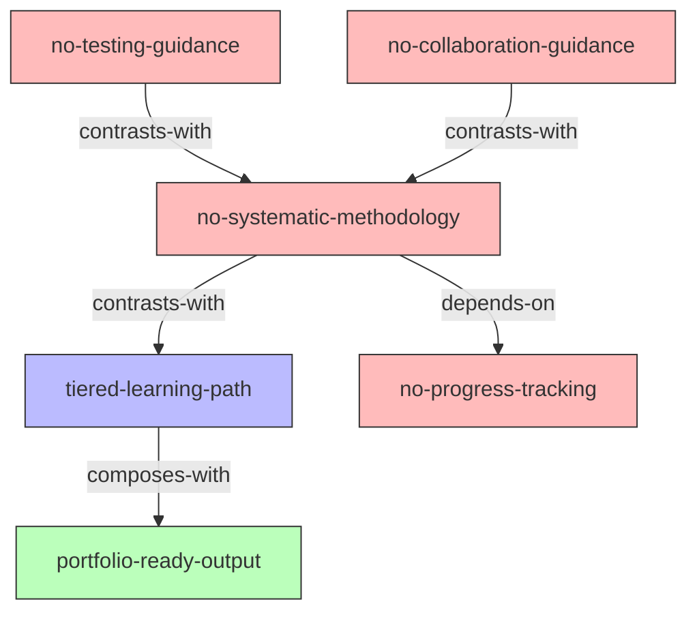

# INDEX.md - florinpop/app-ideas Skills 知识网络

> 基于 Zettelkasten 方法建立的技能引用关系图

## 📊 Skills 概览

| Skill | 类型 | 描述 |
|-------|------|------|
| [tiered-learning-path](./tiered-learning-path/SKILL.md) | Framework | 分级学习路径（Beginner → Intermediate → Advanced） |
| [portfolio-ready-output](./portfolio-ready-output/SKILL.md) | Principle | 作品集就绪输出，关注职业价值 |
| [no-systematic-methodology](./no-systematic-methodology/SKILL.md) | Anti-Pattern | 缺乏系统性方法论的反模式警示 |
| [no-testing-guidance](./no-testing-guidance/SKILL.md) | Anti-Pattern | 缺少测试指导的反模式警示 |
| [no-progress-tracking](./no-progress-tracking/SKILL.md) | Anti-Pattern | 缺少进度追踪的反模式警示 |
| [no-collaboration-guidance](./no-collaboration-guidance/SKILL.md) | Anti-Pattern | 缺少协作指导的反模式警示 |

## 🔗 引用关系图

## 📋 引用关系详解

### composes-with（组合关系）
- **tiered-learning-path ↔ portfolio-ready-output**: 先根据难度选择项目，再确保该项目适合放入作品集。两者可以组合使用形成完整的项目选择策略。

### contrasts-with（对比关系）
- **no-systematic-methodology ↔ tiered-learning-path**: 前者是反面警示（指出 app-ideas 的缺陷），后者是正面指导（提供分级学习路径）。两者互补：先识别问题，再应用解决方案。
- **no-testing-guidance ↔ no-systematic-methodology**: 前者是具体的技术盲点（缺少测试指导），后者是整体框架的缺失。前者更具体，后者更宏观。
- **no-collaboration-guidance ↔ no-systematic-methodology**: 前者是具体的协作盲点，后者是整体框架的缺失。前者更具体，后者更宏观。

### depends-on（依赖关系）
- **no-systematic-methodology → no-progress-tracking**: 整体框架缺失包含进度追踪缺失，理解后者有助于理解前者的具体表现。

## 🎯 使用建议

1. **新手入门**：从 `tiered-learning-path` 开始，理解如何根据难度选择项目
2. **职业导向**：结合 `portfolio-ready-output`，确保项目有职业价值
3. **避免陷阱**：警惕 4 个反模式（no-systematic-methodology, no-testing-guidance, no-progress-tracking, no-collaboration-guidance）
4. **系统化学习**：将正面指导与反模式警示结合，建立完整的学习框架

*最后更新: 2026-08-24*
