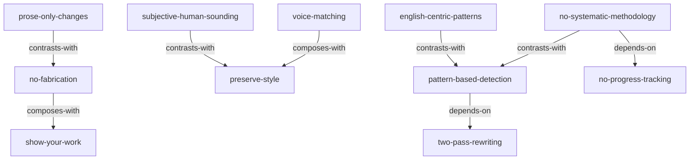

# INDEX.md - blader/humanizer Skills 知识网络

> 基于 Zettelkasten 方法建立的技能引用关系图

## 📊 Skills 概览

| Skill | 类型 | 描述 |
|-------|------|------|
| [pattern-based-detection](./pattern-based-detection/SKILL.md) | Framework | 基于模式的 AI 痕迹检测（35 个模式） |
| [two-pass-rewriting](./two-pass-rewriting/SKILL.md) | Framework | 两遍重写流程（First Rewrite + Critique + Final Rewrite） |
| [voice-matching](./voice-matching/SKILL.md) | Framework | 声音匹配（根据写作样本调整风格） |
| [no-fabrication](./no-fabrication/SKILL.md) | Principle | 不编造事实（所有细节必须来自源或作者） |
| [show-your-work](./show-your-work/SKILL.md) | Principle | 显示工作过程（透明化流程） |
| [preserve-style](./preserve-style/SKILL.md) | Principle | 保持作者风格（个人写作保持风格，技术文本保持中立） |
| [prose-only-changes](./prose-only-changes/SKILL.md) | Principle | 只修改散文（保留代码、数据、frontmatter 和链接目标） |
| [no-systematic-methodology](./no-systematic-methodology/SKILL.md) | Anti-Pattern | 缺乏系统性方法论 |
| [no-progress-tracking](./no-progress-tracking/SKILL.md) | Anti-Pattern | 缺少进度追踪 |
| [subjective-human-sounding](./subjective-human-sounding/SKILL.md) | Anti-Pattern | "像人写的"的主观性 |
| [english-centric-patterns](./english-centric-patterns/SKILL.md) | Anti-Pattern | 以英文为中心的模式列表 |

## 🔗 引用关系图



## 📋 按类型分类

### Frameworks（3 个）
1. **pattern-based-detection**: 基于模式的 AI 痕迹检测
2. **two-pass-rewriting**: 两遍重写流程
3. **voice-matching**: 声音匹配

### Principles（4 个）
4. **no-fabrication**: 不编造事实
5. **show-your-work**: 显示工作过程
6. **preserve-style**: 保持作者风格
7. **prose-only-changes**: 只修改散文

### Anti-Patterns（4 个）
8. **no-systematic-methodology**: 缺乏系统性方法论
9. **no-progress-tracking**: 缺少进度追踪
10. **subjective-human-sounding**: "像人写的"的主观性
11. **english-centric-patterns**: 以英文为中心的模式列表

## 🎯 使用指南

### 新手入门路径
1. 从 `pattern-based-detection` 开始，学习如何识别 AI 痕迹
2. 进入 `two-pass-rewriting`，学习去痕的完整流程
3. 掌握 `voice-matching`，学习如何匹配作者风格
4. 了解 `no-fabrication` 和 `show-your-work`，确保事实准确性和透明化
5. 阅读反模式警示，识别 humanizer 的盲点

### 反模式识别路径
1. 阅读 `no-systematic-methodology`，识别缺乏系统性方法论的问题
2. 阅读 `no-progress-tracking`，识别缺少进度追踪的问题
3. 阅读 `subjective-human-sounding`，识别"像人写的"主观性问题
4. 阅读 `english-centric-patterns`，识别以英文为中心的局限

### 完整去痕工作流程
```
DETECT (pattern-based-detection) → 
REWRITE (two-pass-rewriting) → 
MATCH STYLE (voice-matching / preserve-style) → 
VERIFY (no-fabrication + show-your-work) → 
SAFE OUTPUT (prose-only-changes)
```

*最后更新: 2026-08-24*
