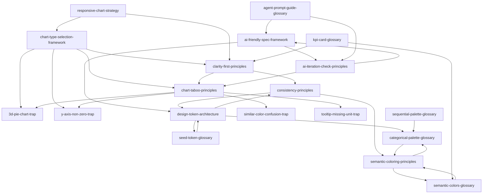

# ENCY-charts Skills Index

> 基于《ENCY-charts 数据可视化设计规范》蒸馏的 19 个 skills，涵盖框架、原则、反例和术语。

## 📊 Skills 概览

| ID | 类型 | Skill 名称 | 核心内容 |
|----|------|-----------|---------|
| F1 | Framework | [chart-type-selection-framework](./chart-type-selection-framework/SKILL.md) | 图表类型选择决策框架 |
| F2 | Framework | [design-token-architecture](./design-token-architecture/SKILL.md) | 设计系统 Token 架构 |
| F3 | Framework | [ai-friendly-spec-framework](./ai-friendly-spec-framework/SKILL.md) | AI 友好的规范编写框架 |
| F4 | Framework | [responsive-chart-strategy](./responsive-chart-strategy/SKILL.md) | 响应式图表策略框架 |
| P1 | Principle | [clarity-first-principles](./clarity-first-principles/SKILL.md) | 清晰性优先原则 |
| P2 | Principle | [consistency-principles](./consistency-principles/SKILL.md) | 一致性至上原则 |
| P3 | Principle | [semantic-coloring-principles](./semantic-coloring-principles/SKILL.md) | 语义化配色原则 |
| P5 | Principle | [ai-iteration-check-principles](./ai-iteration-check-principles/SKILL.md) | AI 迭代检查原则 |
| P6 | Principle | [chart-taboo-principles](./chart-taboo-principles/SKILL.md) | 图表禁忌原则 |
| CE1 | Counter-Example | [3d-pie-chart-trap](./3d-pie-chart-trap/SKILL.md) | 3D 饼图陷阱 |
| CE2 | Counter-Example | [y-axis-non-zero-trap](./y-axis-non-zero-trap/SKILL.md) | Y 轴不从零的误导 |
| CE4 | Counter-Example | [similar-color-confusion-trap](./similar-color-confusion-trap/SKILL.md) | 相似色混淆陷阱 |
| CE5 | Counter-Example | [tooltip-missing-unit-trap](./tooltip-missing-unit-trap/SKILL.md) | Tooltip 省略单位歧义 |
| G1 | Glossary | [seed-token-glossary](./seed-token-glossary/SKILL.md) | Seed Token |
| G2 | Glossary | [categorical-palette-glossary](./categorical-palette-glossary/SKILL.md) | 分类色板 |
| G3 | Glossary | [sequential-palette-glossary](./sequential-palette-glossary/SKILL.md) | 顺序色板 |
| G4 | Glossary | [semantic-colors-glossary](./semantic-colors-glossary/SKILL.md) | 语义色 |
| G5 | Glossary | [kpi-card-glossary](./kpi-card-glossary/SKILL.md) | KPI 指标卡 |
| G7 | Glossary | [agent-prompt-guide-glossary](./agent-prompt-guide-glossary/SKILL.md) | Agent Prompt Guide |

## 🔗 引用关系图



## 📂 目录结构

```
books/ency-charts/
├── INDEX.md                    # 本文件：Skills 索引
├── GLOSSARY.md                 # 术语表
├── verified.md                 # 通过的候选单元
├── PIPELINE_STATE.md           # 流水线状态
├── candidates/                 # 原始提取结果（审计用）
├── rejected/                   # 淘汰的候选单元（审计用）
├── chart-type-selection-framework/
│   └── SKILL.md
├── design-token-architecture/
│   └── SKILL.md
├── ai-friendly-spec-framework/
│   └── SKILL.md
├── responsive-chart-strategy/
│   └── SKILL.md
├── clarity-first-principles/
│   └── SKILL.md
├── consistency-principles/
│   └── SKILL.md
├── semantic-coloring-principles/
│   └── SKILL.md
├── ai-iteration-check-principles/
│   └── SKILL.md
├── chart-taboo-principles/
│   └── SKILL.md
├── 3d-pie-chart-trap/
│   └── SKILL.md
├── y-axis-non-zero-trap/
│   └── SKILL.md
├── similar-color-confusion-trap/
│   └── SKILL.md
├── tooltip-missing-unit-trap/
│   └── SKILL.md
├── seed-token-glossary/
│   └── SKILL.md
├── categorical-palette-glossary/
│   └── SKILL.md
├── sequential-palette-glossary/
│   └── SKILL.md
├── semantic-colors-glossary/
│   └── SKILL.md
├── kpi-card-glossary/
│   └── SKILL.md
└── agent-prompt-guide-glossary/
    └── SKILL.md
```
