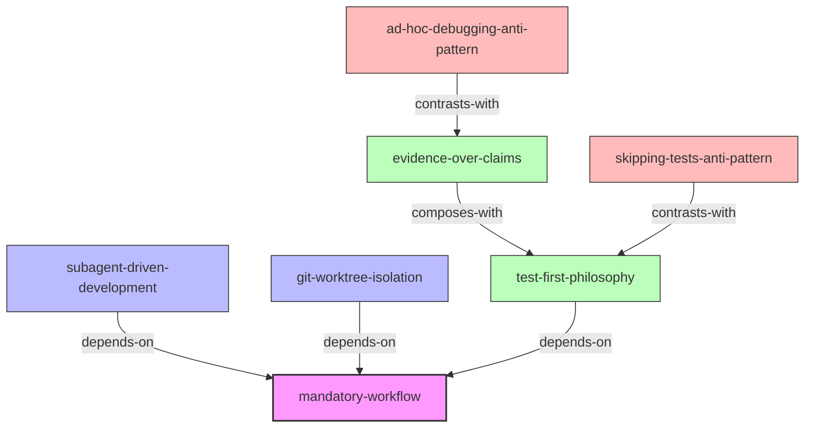

# INDEX.md - obra/superpowers Skills 知识网络

> 基于 Zettelkasten 方法建立的技能引用关系图

## 📊 Skills 概览

| Skill | 类型 | 描述 |
|-------|------|------|
| [subagent-driven-development](./subagent-driven-development/SKILL.md) | Framework | 分派子 Agent + 两阶段审查 |
| [mandatory-workflow](./mandatory-workflow/SKILL.md) | Framework | 7 步强制工作流 |
| [git-worktree-isolation](./git-worktree-isolation/SKILL.md) | Framework | Git worktree 隔离工作区 |
| [test-first-philosophy](./test-first-philosophy/SKILL.md) | Principle | TDD 是强制性的 |
| [evidence-over-claims](./evidence-over-claims/SKILL.md) | Principle | 验证后再声明成功 |
| [skipping-tests-anti-pattern](./skipping-tests-anti-pattern/SKILL.md) | Anti-Pattern | 跳过测试的反模式 |
| [ad-hoc-debugging-anti-pattern](./ad-hoc-debugging-anti-pattern/SKILL.md) | Anti-Pattern | 凭猜测调试的反模式 |

## 🔗 引用关系图

## 📋 引用关系详解

### depends-on（依赖关系）
- **subagent-driven-development → mandatory-workflow**: SDD 是 mandatory-workflow 第 4 步的具体实现，必须先理解整体工作流才能正确使用 SDD
- **git-worktree-isolation → mandatory-workflow**: git-worktree-isolation 是 mandatory-workflow 第 2 步的具体实现
- **test-first-philosophy → mandatory-workflow**: test-first-philosophy 是 mandatory-workflow 第 5 步的具体实现

### composes-with（组合关系）
- **evidence-over-claims ↔ test-first-philosophy**: 验证是 TDD 的最后一步，两者可以一起使用形成完整的测试闭环

### contrasts-with（对比关系）
- **skipping-tests-anti-pattern ↔ test-first-philosophy**: 前者是反面警示（跳过测试），后者是正面指导（测试先行）
- **ad-hoc-debugging-anti-pattern ↔ evidence-over-claims**: 前者是反面警示（凭猜测调试），后者是正面指导（验证后再声明成功）

## 🎯 使用建议

1. **新手入门**：从 `mandatory-workflow` 开始，理解整体框架
2. **并行开发**：学习 `subagent-driven-development` 和 `git-worktree-isolation`
3. **质量保证**：掌握 `test-first-philosophy` 和 `evidence-over-claims`
4. **避免陷阱**：警惕 `skipping-tests-anti-pattern` 和 `ad-hoc-debugging-anti-pattern`

*最后更新: 2026-08-24*
